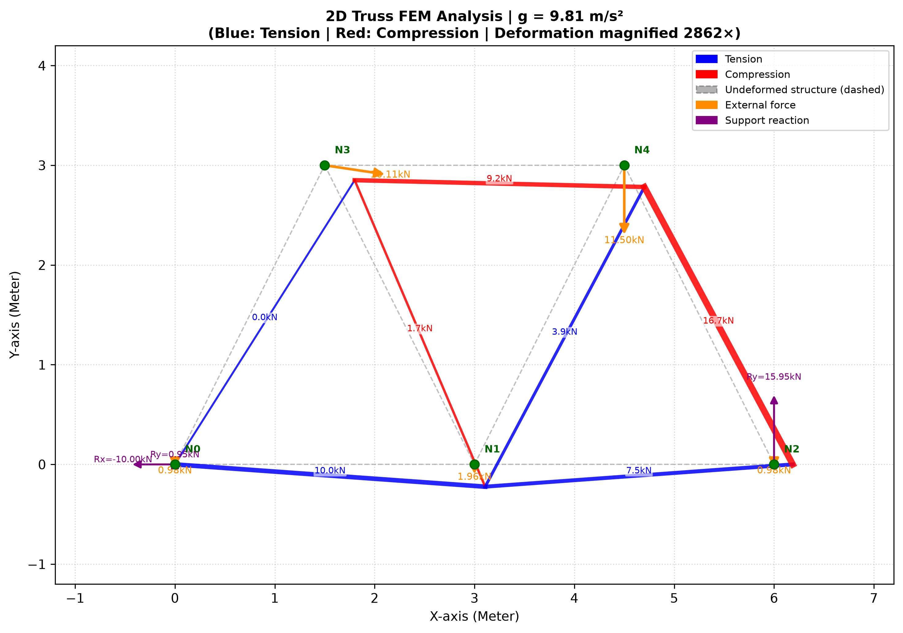

# 2D Structural Truss FEM Solver with Adaptive Self-Weight

A generalized 2D Finite Element Method (FEM) structural solver written in Python. This tool analyzes displacement, axial forces, and support reactions for any custom truss configuration. 

Unlike standard solvers, this program features an adaptive self-weight calculation engine that adjusts automatically based on the gravity of the planetary or custom environmental setting, making it versatile for both terrestrial civil engineering and planetary habitat design.

---

## Key Features

* **Generalized 2D FEM Engine:** Solves displacements, internal member axial forces, and boundary support reactions for arbitrary 2D truss geometries.
* **Automated Self-Weight Conversion:** Mathematically transforms distributed member self-weight into equivalent nodal loads using consistent FEM kinetic formulas.
* **Multi-Environment Gravity Vector:** Adapts calculations to different gravity constants. Default environment is set to Earth ($g = 9.81 \, m/s^2$), but can be customized for environments like the Moon ($1.62 \, m/s^2$) or Mars ($3.71 \, m/s^2$).
* **Automated Visual Output:** Generates vector plots of the truss skeleton highlighting force distributions and deflections.

---

## Mathematical Formulation

The solver is built upon the direct stiffness method formulation for 2D truss elements (Rangka Bidang). The global equilibrium equation for a single element relates the nodal forces to the nodal displacements through the element global stiffness matrix:

$$
\begin{bmatrix} 
f_{x_1} \\ 
f_{y_1} \\ 
f_{x_2} \\ 
f_{y_2} 
\end{bmatrix} = 
\frac{EA}{L} \begin{bmatrix} 
C^2 & CS & -C^2 & -CS \\ 
CS & S^2 & -CS & -S^2 \\ 
-C^2 & -CS & C^2 & CS \\ 
-CS & -S^2 & CS & S^2 
\end{bmatrix}
\begin{bmatrix} 
U_1 \\ 
V_1 \\ 
U_2 \\ 
V_2 
\end{bmatrix}
$$

Where:
* $A$ = Cross-sectional area ($m^2$)
* $E$ = Modulus of Elasticity ($Pa$)
* $L$ = Length of the truss element ($m$)
* $C = \cos\theta$ (Direction cosine relative to the global x-axis)
* $S = \sin\theta$ (Direction sine relative to the global y-axis)
* $f_{x_n}, f_{y_n}$ = Global nodal force components at node $n$
* $U_n, V_n$ = Global nodal displacement components at node $n$

### Gravity Adaptation & Self-Weight
The uniform dead load of each element $w = \rho \cdot A \cdot g$ (where $\rho$ is material density and $g$ is the environmental gravitational acceleration) is distributed equally to its connecting joints (nodes) as structural point loads:

$$F_{\text{nodal gravity}} = \frac{w \cdot L}{2}$$

---

## Sample Visual Output

The program automatically exports a graphical visualization of the truss analysis, showing the deformation profile, node labels, and structural topology:

<p align="center">
  
</p>

---

## Requirements & Installation

Make sure you have Python installed along with the required matrix processing and plotting libraries:

```bash
pip install numpy matplotlib
