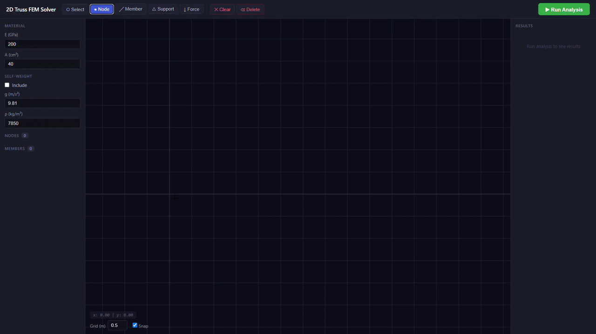

# 2D Truss FEM Solver

A generalized 2D structural truss solver using the **Finite Element Method (FEM)**, built from scratch in Python and upgraded into a full-stack interactive web application.

---

## Demo

> Place nodes → Connect members → Assign supports & forces → Run Analysis → See results instantly



---

## Features

### FEM Solver (Backend)
- **Direct Stiffness Method** — assembles global stiffness matrix [K] and solves F = K · U for nodal displacements, internal axial forces, and support reactions
- **Support types** — Pin (fix X, Y), Roller-Y (fix Y), Roller-X (fix X)
- **Automated self-weight** — calculates and distributes dead load per element based on cross-sectional area, material density, and gravitational acceleration
- **Planetary gravity adaptation** — works for any gravitational environment (Earth 9.81, Moon 1.62, Mars 3.72 m/s²)
- **Equilibrium verification** — automatically checks ΣFx ≈ 0 and ΣFy ≈ 0 as solution validation
- **Stability detection** — checks stiffness matrix condition number before solving; catches unstable or underconstrained structures

### Interactive Web App (Frontend)
- **Canvas-based GUI** — place nodes, connect members, and assign loads directly on an interactive canvas
- **Force input by angle** — input force magnitude (kN) and direction angle (°) instead of Fx/Fy components
- **Real-time color-coded visualization** — blue = tension, red = compression; line thickness proportional to force magnitude
- **Support reaction arrows** — rendered on canvas after analysis (purple arrows)
- **Self-weight indicators** — visualized as downward green arrows on canvas when enabled
- **Results panel** — axial forces, displacements (U, V in mm), and support reactions displayed in the sidebar
- **Zoom & pan** — scroll to zoom, Alt+drag to pan
- **Keyboard shortcuts** — `N` node, `M` member, `P` support, `F` force, `S` select, `Delete` to remove

---

## Tech Stack

| Layer | Technology |
|---|---|
| FEM Solver | Python, NumPy |
| Backend API | FastAPI, Uvicorn |
| Frontend | HTML, CSS, JavaScript (Canvas API) |
| Visualization (legacy) | Matplotlib |

---

## Project Structure

```
2D-Truss-FEM-Solver/
├── backend/
│   ├── main.py       # Standalone CLI FEM solver (original)
│   └── api.py        # FastAPI backend — wraps solver as REST API
└── frontend/
    ├── index.html    # Web app UI
    ├── style.css     # Styling
    └── app.js        # Canvas logic, tools, analysis call
```

---

## How to Run

### 1. Clone the repository
```bash
git clone https://github.com/your-username/2D-Truss-FEM-Solver.git
cd 2D-Truss-FEM-Solver
```

### 2. Install Python dependencies
```bash
pip install fastapi uvicorn numpy
```

### 3. Start the backend
```bash
cd backend
uvicorn api:app --reload
```
Backend runs at `http://127.0.0.1:8000`

### 4. Open the frontend
Open `frontend/index.html` in your browser.

---

## How to Use

| Step | Action |
|---|---|
| 1 | Press `N` or click **Node** tool → click canvas to place nodes |
| 2 | Press `M` or click **Member** tool → click node A then node B |
| 3 | Press `P` or click **Support** tool → click a node → choose Pin / Roller-Y / Roller-X |
| 4 | Press `F` or click **Force** tool → click a node → input magnitude (kN) and angle (°) |
| 5 | Set material properties (E, A) and self-weight settings in the left panel |
| 6 | Click **▶ Run Analysis** |

Results appear instantly on the canvas and in the right panel.

---

## FEM Theory

The solver implements the **Direct Stiffness Method** for 2D pin-jointed truss structures:

```
1. Build local stiffness matrix for each element:
   k = (EA/L) × [c², cs, -c², -cs; ...]   where c = cosθ, s = sinθ

2. Assemble into global stiffness matrix [K]

3. Apply boundary conditions (eliminate restrained DOFs)

4. Solve: {U} = [K_reduced]⁻¹ {F_reduced}

5. Compute axial forces: F = (EA/L) × [-c, -s, c, s] · {u_element}

6. Compute reactions: {R} = [K]{U} - {F_external at supports}

7. Verify: ΣFx ≈ 0, ΣFy ≈ 0
```

Each node has 2 DOFs (U horizontal, V vertical). Minimum 3 restrained DOFs required for a stable 2D truss.

---

## Stability Check

The solver uses the classic truss stability formula:

```
m + r = 2n

m = number of members
r = number of restrained DOFs
n = number of nodes

m + r < 2n → mechanism (unstable)
m + r = 2n → statically determinate
m + r > 2n → statically indeterminate (redundant)
```

---

## License

MIT License — free to use, modify, and distribute.

---

## Author

Built by Muhammad Adhiaska Hilmiyanda · [LinkedIn](https://linkedin.com/in/adhlaska) · [GitHub](https://github.com/adhiaskahilmi)
